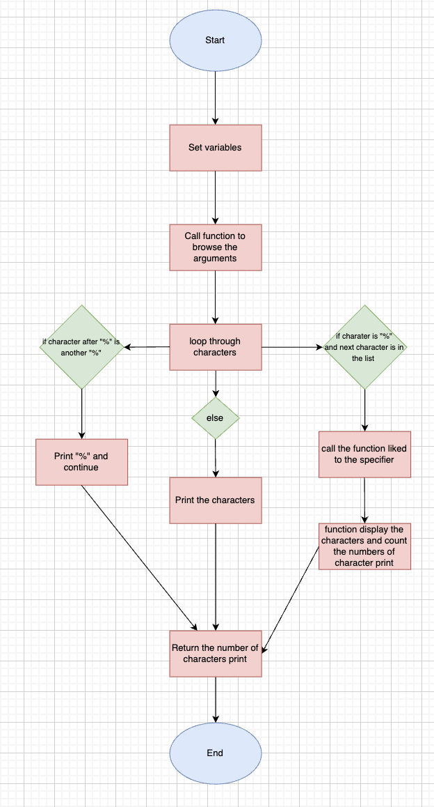

# Project Title

A brief description of what this project does and who it's for

# Project Printf Holberton School

A custom implementation of the printf function in C that handles various format specifiers.

This project implements a simplified version of the `printf` function from the C standard library. It supports the following format specifiers:

- `%c`: Print a single character
- `%s`: Print a string
- `%d` or `%i`: Print a decimal (integer) number
- `%u`: Print an unsigned decimal number
- `%o`: Print a number in octal format
- `%x`: Print a number in lowercase hexadecimal
- `%X`: Print a number in uppercase hexadecimal

## Flowchart

This is a diagram to explain the logic:



## Installation

You have to clone this repo and go in folder holbertonschool-printf:

```
    git clone https://github.com/JulienGirardey/holbertonschool-printf.git
    cd holbertonschool-printf/
```

If all is good you do have these file when you run this command:

```
    :~/holbertonschool-printf# ls
convert_func.c  convert_unsigned_func.c  main.c  main.h  printf  printf.c  _putchar.c

```

## Running Tests

To test my function you have just to run:

```
    :~/holbertonschool-printf# ./printf 
-2147482625
-2147482625
Let's try to printf a simple sentence.
Let's try to printf a simple sentence.
Length:[39, 39]
Length:[39, 39]
Negative:[-762534]
Negative:[-762534]
Unsigned:[2147484671]
Unsigned:[2147484671]
Unsigned octal:[20000001777]
Unsigned octal:[20000001777]
Unsigned hexadecimal:[800003ff, 800003FF]
Unsigned hexadecimal:[800003ff, 800003FF]
Character:[H]
Character:[H]
String:[I am a string !]
String:[I am a string !]
Address:[]
Address:[0x7ffe637541f0]
Percent:[%]
Percent:[%]
Len:[12]
Len:[12]
Unknown:[]
Unknown:[%r]
```

You can modify my test in `main.c`

## Compilation

if you modify a file, you need to compile before running:

```
    gcc -Wall -Wextra -Werror -pedantic -std=gnu89 *.c -o printf
```

## Authors

- [@JulienGirardey](https://github.com/JulienGirardey)